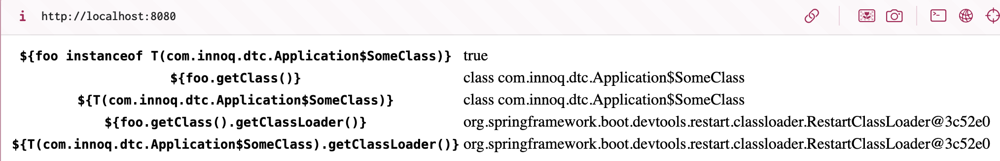
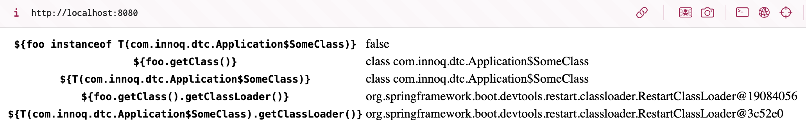

# Spring Boot DevTools Thymeleaf ClassLoader Issue

See [Spring Boot Issue 42690](https://github.com/spring-projects/spring-boot/issues/42690).

## Output of locahost:8080 after start

## Output of localhost:8080 after change and DevTools reload

